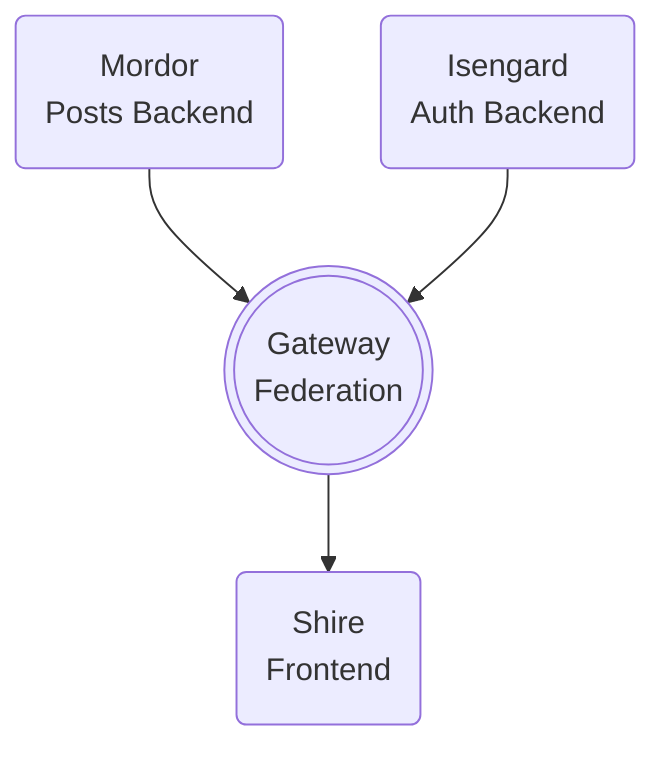

# GraphQL Ins & Outs

**Talk/Workshop by Jorge Duque & Toby Selway**

*CTW Summit - 29/02/2024*

---

## Requirements
See [REQUIREMENTS.md](REQUIREMENTS.md).

## Getting Started
run:
```
docker-compose up --build
```
### Running Tests
make sure the docker-compose is up and run:
```
docker-compose exec gandalf_the_green task run 
```

note: if you have [Taskfile](https://taskfile.dev) installed you can just run (respectively):
```
task up
```
and 
```
task test-docker
```

## High-level Overview



## Project Structure

```c
├── gateway
├── isengard
├── mordor
│   ├── resolvers
│   │   └── post.js // Post resolver
│   ├── entities
│   │   └── Post.js // Post entity (for database)
│   ├── index.js
│   └── schema.gql // GraphQL schema
├── shire
├── test // Test suite to run against API
└── docker-compose.yaml
```

## Applications

### 👥 Isengard
**Authentication backend**

Written in Golang, this application provides a very simple GraphQL API that serves the sole purpose of showcasing how federated subgraphs work.
As such it just returns random quotes


### 🌿 Shire
**Our beautiful frontend**

Written in Nuxt (Vue.js) and styled with Tailwind CSS, this is where we query our gateway
and display our data for our user to see.

We've set it up with a few reasonable queries, but once you've finished feel free
to play around and build upon this any way you like.


### ⛏️ Mordor
**Some other backend**

This is where you come in fellow adventurer.

Your job is to implement what remains of this application in order to complete the product.


### 🔶 Gateway
**Apollo Federation Gateway**

A simple federation gateway implemented in JS with ApolloServer.

This aggregates data from Isengard and Mordor and provides it under a single GraphQL API
so that Shire can query it from one place.


### 📜 Test
**A test suite for sanity**

A set of tests that makes requests to the gateway, ensuring stuff works as it's supposed to.
We hope you like TDD, as this will serve as your guide to success during our quest.
